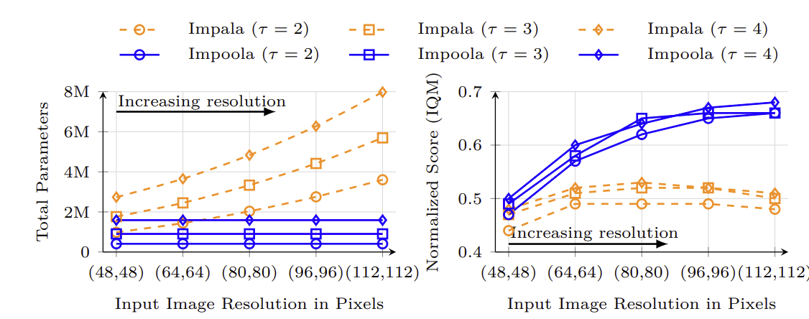

# Visual Scaling in Deep Reinforcement Learning

[](https://github.com/RichardLitt/standard-readme)

This repository is the official implementation of the [paper](https://openreview.net/pdf?id=xNm5W5Widp):

> **Higher Resolution, Better Generalization: Unlocking Visual Scaling in Deep Reinforcement Learning**
>
> [Raphael Trumpp](https://scholar.google.com/citations?user=2ttMbLQAAAAJ&hl=en)\*, [Ömer Veysel Çağatan](https://scholar.google.com/citations?user=FpSkrNMAAAAJ&hl=en&oi=sra)\*, [Barış Akgün](https://scholar.google.com/citations?user=5sL0xZ4AAAAJ&hl=en&oi=sra), and [Marco Caccamo](https://scholar.google.com/citations?user=Jbo1MqwAAAAJ&hl=en&oi=ao).
> &emsp; \* Equal contribution.
>
> **Published in**: *Transactions on Machine Learning Research (TMLR)*, 2026. 
> 
> **OpenReview Paper Page**: [https://openreview.net/forum?id=xNm5W5Widp](https://openreview.net/forum?id=xNm5W5Widp)

⚡ **TL;DR**: Observation resolution is a critical variable for policy learning: higher-resolution visual inputs can substantially improve DRL performance and generalization when paired with architectures (such as **Impoola**) capable of processing them effectively.

<p align="center">
  
  <br />
  <em><b>Figure 1</b>: Normalized scores on Procgen-HD benchmark across observation resolutions ((48,48) to (112,112)) and network width scales (τ = 2 to 4). Visual scaling with the Impoola architecture, which incorporates Global Average Pooling, yields consistent performance gains while decoupling parameter count from input resolution.</em>
</p>

---

## Table of Contents
- [Background](#background)
- [Procgen-HD Benchmark](#procgen-hd-benchmark)
- [Installation](#installation)
- [Usage](#usage)
  - [PPO Training](#ppo-training)
  - [Key Command-Line Arguments](#key-command-line-arguments)
  - [Running Benchmark Suites](#running-benchmark-suites)
- [Plotting & Visualizations](#plotting--visualizations)
- [Repository Structure](#repository-structure)
- [Reference](#reference)
- [License](#license)

---

## Background

Pixel-based deep reinforcement learning (DRL) agents are typically trained on heavily downsampled visual observations (e.g., (64,64) pixels in Procgen or (84,84) in Atari 2600)—a historical convention inherited from early 2013-era GPU hardware constraints rather than grounded in principled architectural design.

In our paper, we show that **observation resolution is a critical yet overlooked variable for policy learning**: higher-resolution inputs can substantially improve both performance and zero-shot generalization, provided the network architecture can process them effectively:

1. **The Visual Scaling Effect**: Training visual DRL policies on higher-resolution inputs (e.g., (96,96), (112,112)) yields consistent improvements across resolutions and network widths (Figure 1). Environment-level analysis reveals that the largest gains consistently occur in environments requiring precise perception of small or distant entities (such as *BigFish*, *StarPilot*, *Dodgeball*, and *Fruitbot*).
2. **Architectural Bottleneck in Standard Impala**: The widely used **Impala** encoder flattens spatial feature maps into a vector, suffering from quadratic parameter growth ($O(H \times W)$) as resolution increases, and fails to leverage the additional visual detail (Figure 1, left).
3. **Resolution Decoupling via Impoola**: Introducing a Global Average Pooling (GAP) layer, as in the **Impoola** architecture, decouples parameter count from resolution. At their respective best conditions, visual scaling unlocks a **28% performance gain** for Impoola over Impala (Figure 1, right).
4. **Mechanistic Insights**:
   - **Spatially Localized Attention**: Gradient saliency analysis reveals that higher-resolution observations enable a more spatially localized visual attention of the policy focused on task-critical entities.
   - **Inactive Neuron Pathologies**: Impala tends to disperse its gradient signal and accumulates inactive (dormant) neurons as resolution grows, whereas Impoola maintains lower dormant neuron fractions.

---

## Procgen-HD Benchmark

Standard Procgen natively forces observations to a fixed (64,64) resolution. To enable visual scaling experiments at higher resolutions, this repository relies on **`procgen-hd`**, our custom fork of the original Procgen codebase.

`procgen-hd` allows configuring arbitrary observation dimensions (`obs_height` and `obs_width`) directly in the Gym environment interface without altering the underlying level generation logic, rendering rules, or reward structures. For benchmark details and source code, see the [Procgen-HD repository](https://github.com/raphajaner/procgen-hd).

---

## Installation

### 1. Environment Setup
We recommend using a Python virtual environment (Python 3.9+):
```bash
python -m venv visual_scaling_env
source visual_scaling_env/bin/activate
```

### 2. Install Dependencies
Install PyTorch and core RL dependencies:
```bash
pip install torch torchrl numpy tyro matplotlib torchinfo wandb torch-pruning stable_baselines3 tqdm psutil gym==0.26.2 gymnasium==0.28.1 envpool opencv-python
```

### 3. Install Procgen-HD Benchmark
Install `procgen-hd` from source:
```bash
# Clone and install procgen-hd fork
git clone https://github.com/raphajaner/procgen-hd.git
pip install -e procgen-hd/
```

*Note for Ubuntu/Debian users*: If build dependencies are missing for Qt5 or CMake, install them via system packages:
```bash
sudo apt-get install qtbase5-dev libqt5opengl5-dev
pip install cmake
```

---

## Usage

### PPO Training
Train a PPO agent on Procgen using `ppo_training.py`.

- **Baseline Impala at (64,64)**:
  ```bash
  python ppo_training.py --env_id fruitbot --obs_res 64 64 --encoder_type impala
  ```

- **Visual Scaling with Impoola Encoder at (96,96)**:
  ```bash
  python ppo_training.py --env_id fruitbot --obs_res 96 96 --encoder_type impoola
  ```

- **High-Resolution Scaling (112,112) with Impoola under Hard Distribution Mode**:
  ```bash
  python ppo_training.py --env_id starpilot --obs_res 112 112 --encoder_type impoola --distribution_mode hard
  ```

---

### Key Command-Line Arguments

Arguments are managed via [`tyro`](https://github.com/brentyi/tyro) in `ppo_training.py`:

| Parameter | Type | Default | Description |
|---|---|---|---|
| `--encoder_type` | `str` | `impoola` | Encoder backbone model architecture (`impoola`, `impala`, `nature`) |
| `--obs_res` | `int int` | `64 64` | Observation resolution `(height, width)` (e.g. `64 64`, `96 96`, `112 112`, `256 256`) |
| `--scale` | `int` | `2` | Network width scaling factor ($\tau$) |
| `--env_id` | `str` | `bigfish` | Procgen environment ID (e.g., `fruitbot`, `starpilot`, `dodgeball`, `ninja`, `coinrun`, etc.) |
| `--distribution_mode` | `str` | `easy` | Procgen level distribution mode (`easy` or `hard`) |
| `--total_timesteps` | `int` | `25000000` | Total training environment steps (default: 25M) |
| `--track` / `--no-track` | `bool` | `True` | Track metrics with Weights & Biases |
| `--wandb_project_name` | `str` | `visual-scaling-drl` | W&B project identifier |

---

### Running Benchmark Suites

We provide launch scripts in `benchmark_utils/` for executing multi-seed, multi-GPU benchmark suites across all 16 Procgen environments.

To launch the **Procgen-HD Visual Scaling Benchmark**:
```bash
CUDA_VISIBLE_DEVICES=0,1,2,3 bash benchmark_utils/run_easy_mode.sh
```

Available benchmark scripts (`benchmark_utils/`):
- `benchmark_utils/run_easy_mode.sh`: Full visual resolution scaling benchmark suite on Procgen-HD (Easy distribution mode).
- `benchmark_utils/run_hard_mode.sh`: High-resolution visual scaling benchmark suite under Hard level distribution mode (100M timesteps).
- `benchmark_utils/run_efficiency.sh`: Sample efficiency benchmark suite on full unlimited level distribution (`env_track_setting=efficiency`).
- `benchmark_utils/run_gpu_timing.sh`: GPU/CPU execution timing, wall-clock speed, and memory usage profiling suite.
- `benchmark_utils/run_ablations.sh`: Architectural ablation suite (5x5 kernels, bottleneck dims, head normalization).
- `benchmark_utils/run_saliency.sh`: Example observation rendering across resolutions for saliency map generation.

---

## Plotting & Visualizations

Plotting scripts in `plot_utils/` query Weights & Biases (W&B) logs and render paper figures using `rliable` aggregate metrics. Launch any plot generation script as follows:

```bash
bash plot_utils/plot_easy_mode.sh
```

For environment setup and the complete figure-to-script mapping, see [`plot_utils/README.md`](plot_utils/README.md).

---

## Repository Structure

```
visual-scaling-drl/
├── ppo_training.py                 # Main entry point for PPO training & evaluation
├── visual_scaling_drl/             # Core Python library
│   ├── nn/                         # Neural network encoders (Impala, Impoola, NatureCNN, GAP pooling)
│   ├── train/                      # Training loops, agent wrappers, and env builders (make_env.py)
│   ├── eval/                       # Evaluation suites and normalized score metrics
│   └── utils/                      # Helper utilities, gradient saliency (gradient_saliency.py), and dormant neuron recycling (redo.py)
├── benchmark_utils/                # Multi-GPU, multi-seed benchmark execution scripts
├── plot_utils/                     # Plotting scripts for paper figures and visual saliency map generation
├── docs/                           # Documentation images
├── LICENSE                         # GNU General Public License v3.0 (GPL-3.0)
└── README.md                       # Repository overview and guide
```

---

## Reference

If you find our work or code useful in your research, please consider citing our paper:

```bibtex
@article{trumpp2026higher,
    title={Higher Resolution, Better Generalization: Unlocking Visual Scaling in Deep Reinforcement Learning},
    author={Raphael Trumpp and {\"O}mer Veysel {\c{C}}a{\u{g}}atan and Bar{\i}{\c{s}} Akg{\"u}n and Marco Caccamo},
    journal={Transactions on Machine Learning Research},
    year={2026},
    url={https://openreview.net/forum?id=xNm5W5Widp}
}
```

---

## License & Acknowledgements

This project is licensed under the [GNU General Public License v3.0 (GPL-3.0)](LICENSE) © [raphajaner](https://github.com/raphajaner).

We gratefully acknowledge open-source tools and foundational implementations that made this work possible:
- **Impoola Repository** ([raphajaner/impoola](https://github.com/raphajaner/impoola)): Core PPO training codebase, Impoola encoder architecture, and Procgen evaluation routines (originally adapted from [CleanRL](https://github.com/vwxyzjn/cleanrl)).
- **OpenRLBenchmark & Rliable** ([google-research/rliable](https://github.com/google-research/rliable)): Evaluation metrics, IQM performance profiles, and plotting utilities.
- **ReDO** ([timoklein/redo](https://github.com/timoklein/redo)): Dormant neuron analysis and recycling algorithms.
